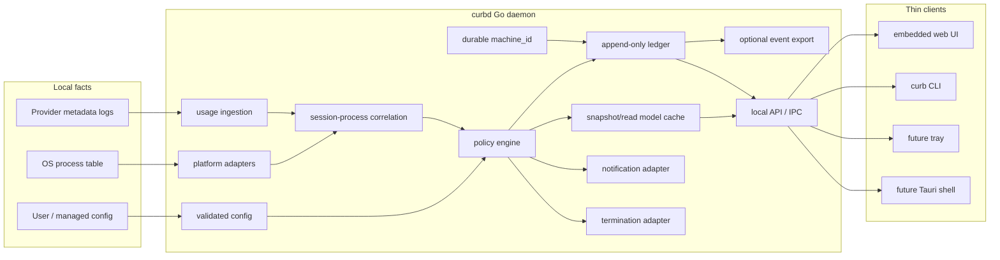

# Curb Application Design

Status: canonical design target
Date: 2026-05-22

## Intent

Curb should be a local application for seeing and controlling AI-agent usage on
one machine. The first useful question is not "which processes have been alive
the longest?" It is:

```text
What is spending tokens right now, what is idle, what is risky, and what can
Curb safely do?
```

The app is a usage monitor with process correlation. Runtime is supporting
evidence. Token turns are the primary risk primitive.

## Product Shape

Curb is one deep local endpoint agent with thin clients:

- `curb daemon`: long-running local service and only authority for state,
  policy, and enforcement.
- embedded web app: first application surface, served by the Go binary.
- CLI: compact local control and script surface over the same service.
- future native shell: Tauri window/tray/installer around the same local API.

The immediate product should ship as:

```sh
curb app
```

That command starts or connects to the local service, serves the embedded UI,
opens the app, and leaves the daemon responsible for scanning, notifications,
ledger writes, and policy actions.

Native packaging is important, but it is not the architecture. Tauri should be
added only after the daemon lifecycle, read model, notifications, and config
contract are stable.

## Core Architecture



### Daemon Responsibilities

The daemon owns every stateful, privileged, or safety-critical concern:

- provider metadata discovery and incremental usage ingestion;
- process capture, platform enrichment, and process identity;
- session construction and per-turn token accounting;
- idle/running/spending classification;
- session-to-process correlation;
- policy evaluation;
- platform notification delivery;
- acknowledgement and grace state;
- process termination;
- append-only ledger writes;
- durable local machine identity;
- optional metadata-only ledger export;
- config validation, persistence, and managed-policy merging;
- service-owned UI/API read models.

### Client Responsibilities

Clients own presentation and explicit user intent:

- sort, filter, and select rows;
- render service-owned states and explanations;
- request a rescan;
- acknowledge a session;
- edit first-class policy fields;
- test notifications;
- open local artifacts;
- show degraded capability states.

Clients must not parse provider logs, inspect process trees, recompute policy,
infer actionability, or decide whether a target is safe to terminate.

## Deep Module Boundary

`internal/service` is the application boundary. HTTP, CLI, tray, and future
native shells speak to service-owned views and actions.

Stable views:

- `Overview`: machine status, policy, source health, changes since last scan.
- `SessionView`: provider-neutral usage session and action affordances.
- `TurnView`: per-turn token metadata for a selected session.
- `AgentView`: live worker/process evidence and correlation confidence.
- `AlertView`: current and historical alert projection.
- `ConfigView`: small editable policy surface, not raw YAML.
- `OnboardingView`: first-run explanation and capability summary.
- `PlatformCapabilities`: notification, process, identity, and enforcement
  capability state by platform.

Stable actions:

- rescan;
- update policy config;
- acknowledge a session for a bounded duration;
- test notification delivery;
- complete onboarding;
- stop a correlated session only when policy and identity allow it.

The service boundary hides:

- raw provider log formats;
- raw ledger event structs;
- ledger export transport details;
- matcher internals;
- grace-period maps;
- provider token quirks;
- platform-specific process APIs.

## Primary Data Model

### Session

A session is the product's primary object. It represents a provider-neutral
stream of agent usage and has:

- provider and provider session id;
- stable Curb session key;
- project and working directory when known;
- models;
- turns;
- latest-turn tokens;
- rolling-window tokens;
- total tokens;
- last usage time;
- correlated process identity if known;
- service-generated explanation;
- action affordances.

### Turn

A turn is the smallest spend unit Curb can reason about. It has:

- timestamp;
- request or turn id when known;
- model;
- input tokens;
- cached input tokens;
- cache-creation tokens;
- output tokens;
- reasoning tokens;
- total tokens;
- cumulative tokens where available;
- source metadata.

Prompt text, response text, screenshots, keystrokes, and file contents are not
part of the read model.

### Agent

An agent is live process reality. It may be:

- running and spending;
- running and idle;
- watch-only;
- correlated to a session;
- unmatched to usage;
- absent while historical usage remains visible.

Agents are evidence. Sessions lead the UI because spend is the product.

## State Vocabulary

Use three separate state axes everywhere.

Process state:

- `running`: live worker exists.
- `idle`: live worker exists with no recent correlated spend.
- `watch-only`: visible but not an enforcement target.
- `unknown`: usage exists, but process correlation is missing or weak.
- `no-process`: historical usage exists with no live process.

Usage state:

- `quiet`: no token usage in the current policy window.
- `quiet-high`: historically expensive but currently quiet.
- `spending`: recent usage below threshold.
- `warn`: latest turn crossed warning threshold.
- `stop`: latest turn crossed stop threshold.
- `acknowledged`: policy crossing is suppressed until a bounded time.

Action state:

- `none`: no action needed.
- `notify`: alert has been or should be sent.
- `acknowledge`: user can extend the session.
- `would-stop`: alert mode says enforcement would stop this if enabled.
- `stop-pending`: enforcement mode and grace are active.
- `stopped`: Curb terminated a revalidated worker.
- `blocked`: policy crossed, but Curb cannot prove a safe target.

`blocked` is a successful safety state. The UI should make it legible, not bury
it as a generic error.

## UI Information Architecture

The first screen is the product. It is a dense local operator console, not a
landing page and not a YAML editor.

```text
+----------------------------------------------------------------------------+
| Curb                         ACTIVE       Alert mode    scan 4s ago         |
| 2 sessions spending. 1 warning. Enforcement off. Notifications ready.       |
+----------------------------------------------------------------------------+
| Window tokens     Since scan      Spending       Warnings      Policy       |
| 418k / 15m        +62k            2 sessions     1             1M / 3M turn |
+----------------------------------------------------------------------------+
| Sessions                                      | Selected session            |
| state       spend        model     project    | Codex / curb                |
| spending    320k turn    gpt-5     curb       | Latest turn 320k            |
| idle        55k last     opus      daybook    | Window 418k                 |
| warn        1.4M turn    gpt-5     gradient   | Turn timeline               |
|                                              | Turn breakdown table        |
+----------------------------------------------------------------------------+
| Alerts                                       | Agents                       |
| Codex curb latest turn 1.4M > warn 1M        | Codex worker pid 123 active  |
| Alert mode: no process will be stopped.      | Claude Code pid 456 idle     |
+----------------------------------------------------------------------------+
```

Default hierarchy:

1. Global status.
2. Current token spend and policy risk.
3. Sessions table.
4. Selected-session turn detail.
5. Alerts.
6. Live agents/process evidence.
7. Policy/settings.

Connection plumbing should not dominate the normal viewport. Demo mode must be
visually unmistakable and impossible to confuse with live protection.

## Screens

### First Run

First run is a short guided flow:

1. Show detected providers, usage sources, and live workers.
2. Explain the active mode and whether it can terminate anything.
3. Show notification capability and let the user send a test notification.
4. Show enforceable worker types and watch-only app roots.
5. Show platform capabilities for process capture, process identity evidence,
   and enforcement readiness.
6. Finish with a concrete sentence generated by the service.

For alert mode, the final sentence is:

```text
Curb will notify on high-token turns. It will not stop any process in Alert mode.
Desktop app roots are watch-only.
```

Onboarding should not expose every threshold. Long-term policy editing belongs
in settings.

### Live Dashboard

The dashboard top bar shows:

- global status: `OK`, `ACTIVE`, `WATCH`, or `ACTION`;
- active mode;
- last scan time;
- a one-sentence summary.

Connection editing is secondary chrome. The first viewport must not be dominated
by API URL or token fields. Those fields live behind a compact connection
drawer. The primary viewport instead shows a readiness strip with:

- live API, demo, or connection-error state;
- notification health;
- usage-source health;
- process-capture capability;
- process-identity capability;
- enforcement capability;
- last scan age;
- the service-generated action/safety sentence.

Demo data must be visually marked as illustrative. It must not look like active
protection for the machine.

The metric strip shows:

- tokens in current policy window;
- tokens added since last scan;
- sessions spending now;
- warning sessions;
- stop candidates;
- policy summary.

### Sessions Table

The sessions table is first. Columns:

- process state chip;
- usage state chip;
- latest-turn spend meter against warning and stop thresholds;
- window tokens;
- provider;
- model;
- project or cwd;
- last usage;
- total tokens;
- action state;
- service-generated explanation.

Default sort:

1. actionable stop/warn sessions;
2. currently spending sessions;
3. acknowledged sessions;
4. recently active sessions;
5. idle high-history sessions;
6. process-only idle agents.

Runtime duration never outranks current token spend.

### Selected Session Detail

Selecting a session opens a persistent right rail. It shows:

- provider, session id, project, cwd;
- process state, usage state, action state;
- model chips;
- latest-turn tokens;
- rolling-window tokens;
- total tokens;
- calls/turns;
- acknowledgement state;
- policy explanation;
- correlation confidence and evidence;
- PID plus process start time if correlated;
- turn timeline;
- turn table.

The turn timeline is the key visual surface:

- each row is one service-provided turn in API order;
- bar length is total tokens on the same scale as the warning and stop
  thresholds;
- warning and stop threshold markers are drawn in the same bar track as the
  turn total;
- token-field colors show provider-reported input, cached input, output, and
  reasoning fields without recomputing policy state;
- the selected turn shows compact token-field totals beside the chart;
- clicking a timeline row focuses the matching turn table row.

For performance, old events should be aggregated for charts while exact turn
rows remain available through paginated drill-down APIs.

### Alerts

Alerts are grouped into:

- active;
- acknowledged;
- historical.

Alert copy must include provider/session/project, token count, threshold,
current mode, actionability, and correlation explanation.

Example:

```text
Codex session in curb used 1.4M tokens in its latest turn.
Policy: warn 1.0M, stop 3.0M. Mode: alert. No process will be stopped.
Matched worker: pid 123, started 15:03, provider+cwd confidence 92.
```

Blocked example:

```text
Usage crossed policy, but no live worker matched provider+cwd strongly enough.
Curb will not stop anything.
```

### Policy Settings

Policy is a drawer or secondary route, not the first panel.

Tabs:

- Mode;
- Usage;
- Agents;
- Notifications.

Mode:

- Observe: record only.
- Alert: notify only; never kill.
- Enforce: warn, grace, then stop correlated workers.

Usage:

- warning threshold per turn;
- stop threshold per turn;
- rolling window duration;
- usage scan interval;
- grace period;
- acknowledgement extension.

Agents:

- enabled providers;
- default worker types;
- watch-only app roots;
- enforceable worker processes;
- last seen;
- confidence evidence.

Notifications:

- platform capability;
- local notification toggle;
- last delivered test;
- last error;
- test notification button.

Enforcement cannot be a casual dropdown. Enabling it requires confirmation that
shows current thresholds, grace period, enforceable live workers, watch-only app
roots, last alert-mode dry run, and the invariant that Curb stops only
revalidated workers.

## Local API

Initial API:

```text
GET  /v1/health
GET  /v1/onboarding
POST /v1/onboarding/complete
GET  /v1/snapshot
GET  /v1/overview
GET  /v1/sessions
GET  /v1/sessions/{key}
GET  /v1/sessions/{key}/turns?since=24h&limit=500
GET  /v1/agents
GET  /v1/alerts?limit=50
GET  /v1/events?limit=200
GET  /v1/config
PUT  /v1/config
GET  /v1/notifications/health
POST /v1/notifications/test
POST /v1/sessions/{key}/ack
POST /v1/service/rescan
```

`GET /v1/snapshot` is the coherent dashboard contract. Split endpoints are
projections or drill-downs over the same service-owned state.

HTTP is acceptable for the embedded app when bound to loopback and guarded by a
per-user token or same-origin HttpOnly cookie. Native shells should move toward
Unix domain sockets on macOS/Linux and named pipes on Windows, with loopback
HTTP retained as a fallback.

## Cross-Platform Design

Platform differences live behind Go adapters. The UI sees platform capability
states and explanations, not platform branches.

The service-owned capability view has:

- `platform`: the runtime platform reported by the process snapshot;
- `notifications`: whether local notification delivery is enabled and
  available;
- `process_capture`: whether Curb can sample current process state;
- `process_identity`: whether sampled processes carry start-time and semantic
  identity evidence;
- `enforcement`: whether the current mode, configured agent types, and identity
  evidence allow enforcement in principle.

Capability is machine-level readiness. Per-session safety remains on
`SessionView` through `actionable`, `action_state`, and the service-generated
explanation.

### macOS

- User service: LaunchAgent.
- Managed enforcement: LaunchDaemon only when needed.
- IPC: Unix socket preferred; loopback HTTP acceptable now.
- Notifications: UserNotifications adapter with permission status.
- Identity evidence: PID, start time, uid, executable path, bundle id, code
  signature/team id, process tree.
- Safety rule: app roots remain watch-only.

### Windows

- User service: per-user background process or startup entry for alert mode.
- Managed enforcement: Windows Service.
- IPC: named pipe preferred; loopback HTTP acceptable now.
- Notifications: Windows toast notifications, with explicit degraded state when
  unavailable.
- Identity evidence: PID, creation time, owner SID, executable path, command
  line, Authenticode evidence where available, process tree or Job Object scope.
- Safety rule: cross-session or permission-limited targets degrade to
  watch-only unless the service context can revalidate identity.

### Linux

- User service: `systemd --user`.
- Managed enforcement: system `systemd` service.
- IPC: Unix socket.
- Notifications: Desktop Notifications spec when available.
- Identity evidence: `/proc` pid/start time, uid, executable path, cwd, command
  line, process group or cgroup scope.
- Safety rule: missing `/proc` visibility or notification daemon support is a
  degraded capability, not a fatal app failure.

## Enforcement Invariants

Visibility and alert modes never terminate processes.

Enforcement may terminate only when all are true:

- mode is enforcement;
- latest-turn usage crossed the stop threshold;
- acknowledgement is absent or expired;
- grace period elapsed;
- the session correlates to a live enforceable worker;
- the worker is not a watch-only app root;
- process identity is revalidated immediately before termination;
- identity includes PID, start time, owner, executable or app evidence, and
  process-tree scope evidence.

Implementation should converge on a sealed `TerminationTarget` value produced by
the service after correlation and revalidation. Platform termination should not
accept a bare PID as the domain-level target.

## Performance Targets

Curb should feel light enough to leave open all day.

Targets:

- warm dashboard response under 500 ms;
- UI update visible within 1 second of daemon state change;
- process scan default 15 seconds;
- usage ingestion cadence 1-5 seconds;
- steady daemon CPU under 2 percent on a typical developer laptop;
- steady memory under 150 MB with 10,000 sessions and 250,000 turns;
- initial indexing of 250 MB of provider logs does not block the UI;
- corrupted or unknown log rows count as source-health errors, not fatal
  dashboard failures.

Daemon strategy:

- one shared usage reader for dashboard refresh and policy scans;
- parse provider files incrementally by path, size, mtime, and cursor;
- keep provider parse cache under the service state directory;
- treat parse cache as operational state, separate from the audit ledger;
- cache expensive platform enrichment by executable/app path and signature
  evidence;
- keep exact recent turns in memory;
- aggregate older turns by session, model, and hour;
- paginate turn and event APIs;
- debounce snapshot refreshes.

UI strategy:

- render from service-owned snapshots;
- virtualize large tables;
- use precomputed summaries for charts;
- avoid re-sorting large arrays on every render;
- keep row heights stable during live updates.

## Implementation Sequence

1. Stabilize `internal/service` as the single app contract.
   Keep state labels, explanations, actionability, onboarding, notification
   health, and deltas service-owned.

2. Finish the session-first dashboard.
   Put sessions and selected turn detail above agents. Add the turn timeline and
   make demo/live status unmistakable.

3. Add platform capability reporting.
   Surface notification, identity, process, and enforcement capabilities in
   onboarding and snapshot health.

4. Harden incremental usage ingestion.
   Make cursor/cache performance a prerequisite for a leave-open desktop app.

5. Introduce `TerminationTarget`.
   Replace bare PID enforcement at the domain boundary with a revalidated target
   carrying identity and process-tree evidence.

6. Harden service lifecycle.
   Add single-instance locking, platform user-service install paths, and clear
   daemon start/connect behavior.

7. Add native shell packaging.
   Wrap the same API in Tauri for tray/menu-bar, startup, signing, and installers
   after the daemon contract is stable.

## Build-Next Acceptance Criteria

The next milestone is done when:

- `curb app` opens live same-origin daemon data without token paste;
- onboarding explains detected providers, notification health, mode, and
  watch-only/enforceable boundaries;
- the first visible table is sessions, sorted by current spend and risk;
- selecting a session shows per-turn token breakdown;
- idle live workers are visually distinct from token-spending sessions;
- alerts appear in-app and as platform notifications where supported;
- config editing covers observe/alert/enforce and turn/window thresholds;
- alert mode cannot terminate any process;
- enforcement mode cannot terminate watch-only app roots;
- stop actions are blocked unless identity is revalidated with PID, start time,
  owner, executable/app evidence, and process-tree scope.
